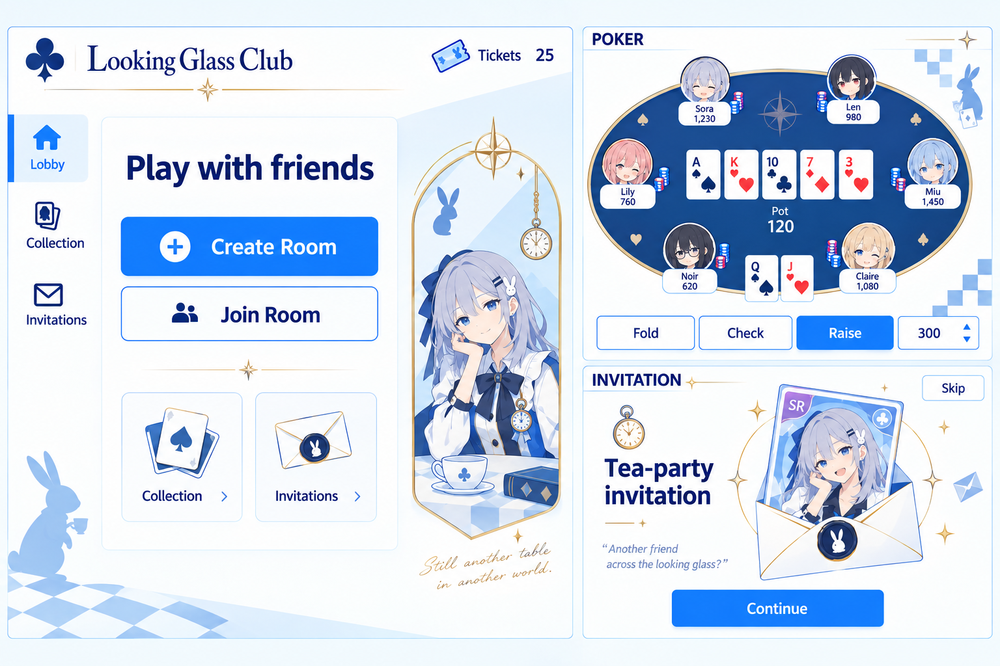

# Anime Poker — Visual and Interaction Design

Date: 2026-09-26  
Status: **Visual direction approved. The local M0–M3 application is implemented; M4 extends this system with the approved celestial vector catalogue and collection/pull surfaces. Detailed specifications remain design defaults, with implementation evidence in plan.md and CHECKPOINT.md. Hosted acceptance is pending.**

## 1. Purpose and source of truth

Design a welcoming private Texas Hold'em game for two to six friends, with earned tickets and a persistent collection of cosmetic avatars and card backs. Players should immediately understand how to create or join a room, recognize their turn, act confidently, and collect cosmetics between hands or sessions.

This document defines appearance and interaction. [plan.md](plan.md) remains the source of truth for product rules, architecture, data contracts, and delivery milestones. Its proposed economy and session tuning remain proposals. A number in a mockup never confirms a rule or an account balance.

Deliverable scope: a design specification and its approved concept reference. Implementation, deployment, new game modes, and economic changes are outside this task.

## 2. Approved direction

**A clean blue-and-white anime interface, with restrained celestial fantasy details and recognizable Wonderland motifs. Function comes first; character art supports the interface.**

The user approved the fourth concept after requesting less visual density, smaller character artwork, and a stronger blend of Genshin and Alice in Wonderland within a Blue Archive-led foundation.

| Influence | Role | Concrete expression |
|---|---|---|
| Blue Archive | Primary interface language | White and pale-blue surfaces, cobalt actions, navy text, geometric accents, clear menus, simple anime portraits |
| Genshin | Secondary fantasy refinement | Fine champagne-gold lines, celestial compass marks, understated collectible framing |
| Alice in Wonderland | Secondary world identity | Looking-glass arch, rabbit seal, pocket watch, tea cup, playing-card suits, sparse checkerboard fragments |

The earlier dark moonlit garden, large character hero, and heavily ornamented fantasy frames are superseded. Preserve the tea-party idea through selected motifs rather than a detailed environment painting.

Confirmed experience decisions:

- Desktop guides the composition; phones remain fully playable in portrait orientation.
- Players appear as portraits around the poker table.
- The lobby prioritizes **Create Room** and **Join Room**.
- Larger character art belongs in the lobby and collection, but stays secondary to controls.
- Gacha uses a short, skippable tea-party invitation reveal.
- The final blend uses fewer sparkles and omits decorative cursive text.

## 3. Approved visual reference

Generated with the built-in image generation tool during the design interview. This is a mood and composition reference, not a pixel-perfect screen specification or production asset sheet.

Generation brief: simplify the preceding blue-and-white anime concept; make the character smaller and the interface dominant; preserve clean menus while introducing restrained celestial gold linework, a looking-glass portrait frame, pocket watch, rabbit seal, checkerboard fragments, and an envelope reveal. Show lobby, six-player poker, and invitation panels together.

Interpretation rules:

- The board shows three different screens, not one page containing all three panels.
- **Looking Glass Club** is a working title, not an approved product name.
- Character identities, ticket balances, stacks, cards, and rarity shown are illustrative.
- Remove handwritten slogans and excess sparkles shown in the image.
- Do not reproduce mockup inaccuracies in card rendering, seating, contrast, or legal actions.
- The written specifications below govern behavior and accessibility.

## 4. Visual system

### Palette

These hex values are implementation defaults derived from the approved direction, not individually selected user values.

| Token | Value | Use |
|---|---|---|
| `canvas` | `#F7FBFF` | Main page background |
| `surface` | `#FFFFFF` | Panels, controls, cards |
| `surface-blue` | `#EAF4FF` | Selected navigation and quiet grouped areas |
| `primary` | `#1765D1` | Main action with white text |
| `primary-hover` | `#104FA9` | Hover/pressed emphasis |
| `text` | `#102A56` | Headings, labels, amounts |
| `text-muted` | `#526480` | Supporting text |
| `line` | `#CBDCEF` | Decorative separators |
| `control-border` | `#637FA3` | Input boundaries and outlined controls |
| `table` | `#173F76` | Poker felt |
| `table-text` | `#FFFFFF` | Pot and table annotations |
| `gold` | `#B99452` | Nonessential celestial lines and ornaments |
| `red-suit` | `#C52D42` | Hearts and diamonds on white cards |
| `black-suit` | `#14233C` | Clubs and spades on white cards |
| `success` | `#16724B` | Confirmed success, with text/icon |
| `warning` | `#805600` | Warnings on a pale background |
| `error` | `#B42336` | Errors, with explanatory text |

Rarity labels: R uses blue, SR uses violet, SSR uses amber/gold. Always print the rarity label; decorative color is never the only signal. Use dark text on pale rarity badges rather than small gold text on white.

Use flat surfaces. Gold occupies only a small accent area, roughly five percent or less of a screen. Reserve a navy field for the table; the surrounding shell remains light. No dark theme in the initial design.

### Typography

- Interface: `Segoe UI`, system sans-serif fallbacks. Keep numbers clear and use tabular numerals for chips, tickets, bets, and timers.
- Optional wordmark: `Georgia` or a similarly restrained serif, only for the eventual product name.
- Desktop page heading: 28–32 px. Phone page heading: 24 px.
- Section heading: 20–24 px. Body and controls: 16 px. Supporting labels: 14 px.
- Never use cursive for instructions, amounts, game state, or button labels.
- Allow labels to wrap where appropriate; do not reduce important text to fit a decorative frame.

### Spacing, shapes, and ornament

- Use a 4 px spacing unit; prefer 8, 12, 16, 24, and 32 px gaps.
- Desktop shell: up to 1440 px, centered, with 24–32 px outer gutters. Phone gutters: 16 px.
- Buttons and inputs: 8 px radius. Panels: 12 px radius. Circular crops are reserved for avatars and small badges.
- Favor whitespace and alignment over nested bordered boxes. A section does not need a card unless grouping helps a task.
- Borders are usually 1 px. Shadows are small and limited to overlays or elevated controls.
- A looking-glass arch is a signature illustration frame, not a universal container shape.
- Each screen gets one main thematic composition and, at most, two small supporting motifs. Avoid placing stars, rabbits, or clocks on every control.

## 5. Artwork and assets

Use original or appropriately licensed anime artwork. Franchise references guide aesthetic decisions; production characters and logos need their own assets.

Character treatment: clean outlines, simplified hair shapes, a limited palette, and restrained cel shading. Avoid glossy doll-like faces, overly detailed costumes, painted scenery behind every portrait, and inconsistent rendering styles.

The equipped avatar provides the lobby portrait. If an avatar lacks a matching larger illustration, use a deliberate enlarged portrait crop inside the arch; do not invent an unrelated character. The large character region occupies at most about one quarter of desktop lobby content width and never overlaps controls. On phones, collapse it to a small portrait header.

Asset set:

| Asset | Treatment |
|---|---|
| Avatars | Consistent crop, readable at 40–64 px; default available without pulling |
| Card backs | Distinct silhouettes/patterns; do not alter card fronts or visibility rules |
| Card fronts | Crisp ranks and standard suits, rendered as interface/vector assets rather than generated text |
| Rabbit, clock, key, tea cup, compass | Small consistent line/vector motif family |
| Envelope | Simple blue-lined paper with rabbit seal; reusable in reveal and empty collection state |
| Lobby background | White/pale-blue geometry with one faint checkerboard fragment; no large scenery asset needed |

The proposed launch catalogue size and rarities come from plan.md and are not expanded by this document. The reference PNG is for review, not a background image to stretch behind working controls.

## 6. Navigation and screen structure

Five primary surfaces follow the product plan: sign-in, lobby/private room, poker/results, invitations/reveal, and collection/equipment.

Outside active play, desktop navigation uses **Lobby**, **Collection**, and **Invitations**. Invitations is the themed name for the cosmetic gacha surface. Room sharing always uses explicit language such as **Copy room link** or **Join Room**, avoiding ambiguity with cosmetic invitations.

On phones, use a compact header and three-item bottom navigation outside gameplay. During live play, replace that navigation with the game action area. Collection and gacha are accessed at safe boundaries, not through overlays hiding a live hand.

A shared ticket indicator opens a plain explanation of ticket earning and the current allowance. Session chips belong to the poker room. No shop, gem counter, ticket purchase button, daily claim, or persistent-chip wallet.

### Sign-in

Show a compact authentication panel with a small rabbit/compass emblem and a pale-blue geometric background. Preserve a room invitation through sign-in so the player returns to its join flow. Use the authentication methods defined by the eventual implementation; this visual design does not select new providers.

Field errors appear next to their field, with a concise summary for submission failures. A waking backend is a server-starting state, not evidence the player has been signed out.

### Lobby

Desktop hierarchy:

1. Compact product header and ticket balance.
2. Clear heading: **Play with friends**.
3. Primary **Create Room** and secondary **Join Room** actions.
4. Small Collection and Invitations shortcuts, subordinate to playing.
5. Supporting character in a looking-glass arch with a pocket watch and restrained celestial linework.

Creation shows pending feedback and enters the waiting room after server confirmation. Joining uses an invitation link or the room identifier supported by the backend; show an input label, validation, and clear room-not-found/full/session-started feedback. Do not imply public room discovery.

### Private waiting room

Show room identity, **Copy room link**, occupied and empty seats, connection status, host identity, and a brief session-rules summary. Copy feedback is inline. The host sees **Start session** when server rules allow it; other players see **Waiting for host**. Do not add a ready-check mechanic absent from the product plan.

Differentiate a pending seat request from a confirmed occupied seat. New arrivals during an active session receive an explicit waiting state consistent with plan.md. Leaving returns to the lobby only after the user can understand the effect on their participation.

### Poker table

Use a wide navy oval on desktop, with six compact portrait seats and a clean central card area. Keep the local player at the bottom of the visual layout while retaining server seat order around the table.

Visual priority: **your available action and deadline → hole cards and community cards → pot, stacks, and bets → portraits → decoration**.

Each seat includes portrait, name, stack, latest action, and relevant dealer/blind markers. Indicate turn with an outline plus **Acting** text and a numeric timer. Show disconnected, folded, all-in, and waiting states with explicit labels; do not dim the entire seat until its text becomes unreadable. Long names truncate visually and remain available in an accessible label or seat detail.

Display main pot and side pots distinctly when present. Render fewer than five community cards naturally during early streets. Never expose private cards through opponent art, labels, tooltips, or alternative text. Revealed showdown cards follow server visibility rules.

The bottom action area shows only server-legal actions. Use **Check** when legal or **Call {amount}** when facing a bet; distinguish **Bet**, **Raise to {total}**, and **All-in {amount}**. An editable amount field and bounded step controls are primary; a slider may supplement them. Explain invalid amounts inline. Do not hardcode the concept board's Fold/Check/Raise combination.

Keep **Fold** secondary and visually separate from the primary action. Never bind a game action to a single global keystroke. Disable submission while awaiting acknowledgement. Do not optimistically change chips or cards; an uncertain result triggers synchronization.

The timer keeps its position throughout the hand. A connection banner and return-to-sync state must not cover the cards or action deadline. The client does not infer that a hand is paused simply because its socket is disconnected.

### Hand and session results

Between hands, use an inline result region for winner(s), hand description when available, chip outcome, and the server-confirmed ticket breakdown. Distinguish zero rewards due to qualification or allowance from a reward still pending. No reward confetti over the next player's controls.

Session results show standings and committed rewards, with host controls for the next session when permitted. Ending a session explains that it takes effect between hands. Aborted sessions use different copy from completed sessions and do not imply rewards for an unfinished hand.

### Invitations and reveal

One permanent cosmetic catalogue. Show the ticket balance, current pull price, available single/ten-pull options from plan.md, owned status where useful, and accessible **Rates & guarantees** information. Explain duplicate handling before a player spends tickets. Values come from product configuration; this document does not lock in the proposed economy.

Use **Open 1 — {cost} tickets** and **Open 10 — {cost} tickets** labels. Submitting spends earned tickets only after the server validates the request. While pending, disable repeat submission. Insufficient tickets explains how to earn more; it never offers a purchase.

After a committed result arrives: envelope appears → rabbit seal opens → reward card is revealed → result actions become available. Use one fine celestial ring as the fantasy accent. Print item name, cosmetic type, rarity, and **New** or **Duplicate** accurately. For ten pulls, provide a compact result grid; avoid forcing ten sequential reveals.

**Skip** completes the animation immediately and shows the committed results. Closing, refreshing, or retrying must not lose the result or reroll. **Continue** returns to the invitation page. **View in Collection** is a secondary action. A post-request network error resolves the existing request/receipt before allowing a new charge.

### Collection and equipment

Separate **Avatars** and **Card backs** tabs. Use a responsive item grid with a preview, item name, rarity label, and explicit ownership/equipment state. Owned items come first; unowned previews are clearly labeled. Empty ownership states show default equipment and explain that tickets come from poker.

An item detail panel shows a larger preview and **Equip avatar** or **Equip card back**. After server confirmation, indicate **Equipped** or **Applies next hand** as appropriate. One avatar and one card back can be equipped at a time. Equipment never implies a gameplay bonus.

## 7. Responsive behavior

| Width | Layout default |
|---|---|
| 1200 px and above | Full navigation, wide lobby with small supporting art, horizontal table |
| 768–1199 px | Narrow navigation, reduced ornaments, flexible two-column lobby where space permits |
| Below 768 px | Single-column lobby, small character header, portrait table, bottom controls |

Mobile is a dedicated composition, not a scaled screenshot. For six seats, place the local player at bottom center, one opponent at top center, and two on each side, with a central band reserved for community cards and pot. Adapt spacing to avoid collisions rather than shrinking card ranks below readability. Hide decorative motifs before reducing controls.

At 360 px width, reserve roughly 224 px for five community cards with clear ranks; stack secondary seat details if required. Use 40–48 px portraits and maintain usable text. The bottom action dock respects the safe area; opening an amount input must not obscure the active controls. In compact heights, remove the decorative header and reduce empty space first.

Targets: no horizontal page scrolling at 360 px; primary interaction targets at least 44 × 44 px; timer, pot, hole cards, and legal actions stay available during a hand. Short landscape devices may use a compact wide arrangement without requiring rotation from portrait.

## 8. Shared component inventory

| Component | Responsibilities and important states |
|---|---|
| App shell | Desktop/mobile navigation, ticket indicator, account menu |
| Primary/secondary button | Hover, focus, pressed, pending, disabled; optional useful icon |
| Form field | Label, hint, valid value, inline error, disabled/pending |
| Room seat | Empty, occupied, host, connecting, waiting |
| Player seat | Current turn, folded, all-in, disconnected, showdown |
| Playing card | Rank/suit face, hidden back, permitted reveal, selected winning cards |
| Action dock | Legal action set, amount validation, pending acknowledgement, synchronization |
| Ticket summary | Balance, allowance, pending data, committed reward breakdown |
| Cosmetic item | Owned, unowned, default, equipped, next-hand pending, rarity |
| Invitation reveal | Request pending, committed reveal, skipped, results, recovery |
| Dialog/sheet | Focus containment, close/return focus, clear action labels |
| Inline status | Loading, empty, error, reconnecting, server starting, success |

Use the same visual states across screens. Destructive or costly actions describe the consequence in their label or adjacent copy. Do not place a generic confirmation dialog in front of every poker action.

## 9. Motion and accessibility

Motion defaults: 120–180 ms control feedback, 180–240 ms panel transitions, 150–250 ms card dealing/reveals, and a maximum roughly 1.5-second single invitation reveal before results. Animation never extends a turn deadline or blocks the next action.

Use motion to explain a state change. Avoid infinite floating objects, idle character motion, parallax scenery, flashing rarity effects, and large screen shake. With reduced motion, show cards and rewards immediately or with a brief opacity transition; retain every label and result.

Implementation acceptance targets:

- Normal text contrast at least 4.5:1; large text and essential non-text controls at least 3:1 against adjacent colors. Verify actual combinations, including hover/disabled presentation where relevant.
- Visible keyboard focus on all controls. Keyboard access and sensible focus order for joining, betting, inspecting results, and equipping.
- Suits use shape plus color; player state and rarity use text plus color.
- Announce meaningful turn changes, connection changes, and submitted outcomes; do not announce every timer tick.
- Dialogs and sheets restore focus when dismissed. Form errors are programmatically associated with their inputs.
- Essential content remains usable with text zoom; prioritize gameplay information over decorative art.

## 10. Loading, failure, and unusual states

| Situation | Required presentation |
|---|---|
| Initial data loading | Stable layout skeleton; no invented zero balance or fake player data |
| Backend waking | “Starting the game server…” with bounded retry feedback; preserve sign-in and invitation context |
| Room cannot be joined | Specific reason and a route back to Join Room/Lobby |
| Player reconnecting | Persistent inline status; preserve last known display as stale and disable invalid actions until synchronized |
| Another tab controls the seat | Explain the control status and use only the recovery path supported by the backend |
| Action outcome uncertain | Pending/synchronizing state; do not submit a second action automatically |
| Session interrupted by restart | Explain that the session ended and committed cosmetics/tickets remain; offer the server-supported new-session route |
| Ticket allowance exhausted | Show remaining allowance truthfully; poker remains playable |
| Pull request outcome uncertain | Resolve the same request/receipt before another spend |
| Duplicate cosmetic | Label Duplicate and show the configured policy, with no invented refund |
| Equip fails | Keep previous equipment; show error and retry |
| Long names or large chip totals | Truncate names accessibly; preserve full numeric values in a suitable expanded view |

## 11. Implementation boundaries

Follow the existing Next.js/Tailwind frontend and NestJS-backed authority in plan.md. This specification does not replace its architecture, introduce a new state library, or add features to its release scope.

Keep tokens and reusable controls shared. Render cards, suits, borders, motifs, and simple envelope geometry with code/vector assets; use raster assets for actual character artwork. Load only current-screen art and make detailed item previews lazy. Missing artwork must leave a usable labeled fallback, not an empty interaction target.

The server remains authoritative for cards, legal actions, stacks, rewards, ticket spending, ownership, and equipment. The client owns presentation and animation. Never imply success with an animation before the corresponding confirmed outcome.

English labels are the drafting default used in the reviewed mockups. Final product naming and additional languages are open branding/content decisions, not blockers for reviewing this specification.

## 12. Review checklist

Before accepting a future implementation:

- The first screen clearly offers Create Room and Join Room; supporting artwork does not dominate.
- White/blue structure leads; Genshin and Wonderland details are recognizable without scenery clutter.
- No decorative cursive, repeated gold frames, generic marketing slogans, or unnecessary sparkles.
- All six seats, cards, pot, bets, timer, and legal actions remain legible at desktop and 360 px portrait phone sizes.
- Poker distinguishes check/call, bet/raise, all-in, side pots, pending commands, reconnecting, and showdown visibility.
- Chips and tickets are separate; no unplanned purchases or daily claims appear.
- One-pull and ten-pull result states handle insufficient tickets, duplicates, skip, refresh, and uncertain requests.
- Equipment displays its server-confirmed state and next-hand timing.
- Keyboard flow, reduced motion, text contrast, long names, and large amounts are checked on actual screens.
- The working title and reference artwork are not misrepresented as final branding or production-ready assets.

The original design specification is preserved. M4 surface implementation and finish-review evidence are recorded in [docs/m4-ui-direction.md](docs/m4-ui-direction.md); current verification and remaining release gates are recorded in [plan.md](plan.md) and [CHECKPOINT.md](CHECKPOINT.md).
