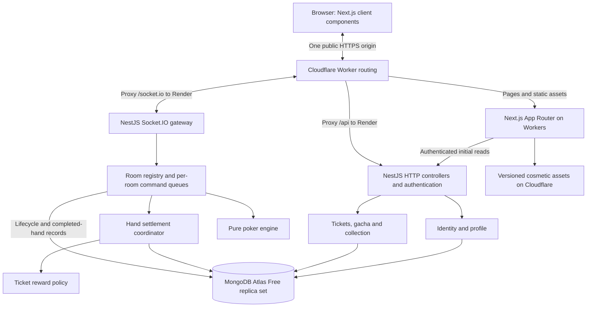

# Poker Anime Gacha — Consolidated System Design

Updated: 2026-09-26
Status: **Consolidated planning baseline. The overall architecture, stack, and free-tier hosting direction have been accepted. Gameplay tuning defaults remain explicitly identified. Implementation and deployment have not begun as part of this design task.**

Design this application from a blank slate, using only the product requirements in this file. Existing code, repository status, historical architecture, migrations, and earlier implementation choices are not inputs to this design. This is the single system-design and handoff document: product scope, architecture, contracts, data model, deployment, verification, delivery sequence, and checkpoint are all included here. External documentation links are technical references; no other repository document is required to understand the design.

## System at a glance

Build a private two-to-six-player Texas Hold'em game for friends with a cosmetic anime collection. Each session starts with equal temporary poker stacks. Completed hands earn persistent tickets; tickets buy cosmetic pulls, and owned avatars/card backs can be equipped for later hands. Cosmetics never affect poker strength.

| Decision | Final direction |
|---|---|
| User experience | Sign in -> invite friends -> play consecutive hands -> earn tickets -> pull -> equip -> return later with progress intact |
| Frontend | Next.js App Router, TypeScript, Tailwind CSS, TanStack Query, and minimal Zustand live state |
| Backend | Separate NestJS application on Node.js, default Express adapter, Socket.IO gateway, explicit domain modules |
| Poker authority | Pure engine called by the backend; one serialized command queue per room; private cards projected per recipient |
| Persistent data | MongoDB via the official driver; replica-set transactions for completed hands/rewards and paid pulls |
| Hosting | Cloudflare Workers Free for frontend/proxy, Render Free for NestJS, MongoDB Atlas Free for persistence |
| Public access | One workers.dev origin; API and WebSocket traffic proxied to Render; browser uses secure session cookies |
| Reliability boundary | Reconnect restores a live room; backend restart aborts interrupted sessions; committed tickets and cosmetics survive |
| Launch budget/scope | $0 target within quotas, one active room initially, no purchases, trading, public matchmaking, or paid services |
| Delivery | M0 foundation -> M1 private rooms -> M2 poker -> M3 tickets -> M4 collection -> M5 friends playtest |

Sections 1–5 define the product and its initial tuning proposals. Sections 6–15 define how the system works. Section 16 defines acceptance evidence. Sections 17–18 record decisions and the checkpoint. Section 19 contains the M0/M1 implementation plan. Configuration values labelled as proposals are not silently promoted to individually confirmed user decisions.

## 1. Confirmed decisions

| Topic | Agreed direction |
|---|---|
| First audience | A small private group of friends |
| First release | Multiplayer poker plus a small anime gacha collection; pull, collect, and equip |
| Currency separation | Chips for poker; earned tickets for gacha |
| Ticket source | Playing poker only; no daily ticket claim |
| Ticket rewards | Participation rewards plus a win bonus |
| Poker chips | Fresh equal stacks for every group session, not every hand |
| Session length | Open-ended; the host decides when to end the session |
| Persistent progress | Tickets and cosmetics survive between sessions |
| Development | Primarily the user working with Codex; sequential milestones |
| Web framework | Next.js with App Router; React is its underlying UI library |
| Backend framework | NestJS, using its default Express HTTP adapter |
| Database | MongoDB |
| Playtest hosting | Cloudflare Workers Free frontend, Render Free NestJS backend, MongoDB Atlas Free database |
| Hosting budget | Target $0/month within free allowances; paid upgrades require a separate decision |

The product is Texas Hold'em with virtual currency and cosmetic-only gacha. No cosmetic changes cards, odds, available information, or poker strength. Poker chips cannot pay for pulls or convert into tickets.

Daily working hours and a release date have not been supplied. Delivery uses sequential milestones for the user working with Codex, without a calendar estimate.

## 2. First-release experience

A friend signs in, creates a private room, and shares an invitation. Two to six friends take seats. The host starts a group session with equal stacks. They play consecutive hands, earning persistent tickets through participation and wins. Between hands or sessions, they spend tickets on anime cosmetics, equip them, and see them at the table.

**Success:** friends can complete a session, reconnect after a brief interruption, receive the correct tickets, pull a cosmetic, equip it, and retain it after signing out and back in.

Proposed first-release scope:

- Account sign-in and room invitations; no public matchmaking.
- One poker mode: no-limit Texas Hold'em, two to six seats.
- A readable table, legal betting controls, turn timer, hand result, and session result.
- One permanent gacha banner, collection page, and avatar/card-back equipment.
- Basic responsive layouts for desktop and phone; modest animation with reduced-motion support.
- Clear connection, insufficient-ticket, loading, and retry states.

Defer public leaderboards, tournaments, additional poker variants, trading, purchases, seasonal banners, table themes, elaborate animated characters, and social features. Chat is optional and must not block the core flow.

## 3. Proposed session rules — review required

| Rule | Draft default |
|---|---|
| Starting stack | 1,000 chips per player |
| Blinds | Fixed 10/20 for the session |
| Session length | No fixed hand limit; host ends the session (confirmed). Automatic end with fewer than two funded players remains a proposed default |
| Host ending the session | Takes effect between hands; completed rewards remain |
| Seats | Lock at session start; newcomers wait for the next session |
| Bust-out | Observe the current session; no individual refill or re-entry |
| Next session | Host starts again with fresh equal stacks for all seated players |
| Turn timeout | 30 seconds; auto-check if legal, otherwise auto-fold |
| Disconnect | Seat and stack remain; normal timeout rules continue; authenticated reconnect restores the player's view |
| Host disconnect | Transfer host controls to the next connected seated player |
| Empty room | Abort the unfinished hand and close the session once every seated player has been disconnected for two minutes |
| Server restart | Mark interrupted sessions aborted; retain committed rewards and cosmetics; start a fresh session |

A session contains multiple hands. Stacks carry between those hands but never convert into tickets or permanent currency. A tied session result may have multiple leaders. Session standing does not add another ticket bonus in this draft.

Restart recovery is intentionally limited to ending interrupted sessions cleanly for the first private release. Durable restoration of an in-progress hand is a later enhancement. Do not award rewards for aborted hands.

## 4. Proposed ticket economy — review required

Use whole tickets to keep the first version understandable:

- A qualifying completed hand awards **1 ticket** for participation.
- A qualifying player with a positive net chip result for that hand receives **1 additional ticket**. Net result means payouts minus all contributions, including blinds; merely receiving a split-pot payout is not automatically a win bonus.
- Qualification requires being dealt into the hand and making at least one valid manual action. A manual fold qualifies. Only automatic actions or timeouts do not qualify. Under this simple launch rule, a player forced all-in by a short blind with no opportunity for a manual action does not earn tickets for that hand; include this edge case in playtest review.
- Cap total earned tickets at **20 per account per UTC day**, across all rooms and sessions. This is a proposed earning limit, not a daily claim or gift.
- Start accounts with zero tickets. Resetting a session does not reset ticket balances or earning limits.
- Single pull: **5 tickets**. Ten-pull: **50 tickets**, with no launch discount.
- Publish reward amounts, remaining daily earning allowance, and pull prices in the UI.

Example: participating in five qualifying hands and having a positive net result in two earns seven tickets before the cap: one pull plus two tickets remaining. Losing players still make collection progress.

These are initial tuning values, not established balance results. Evaluate the pace during a friends playtest. The cap and authenticated, once-only rewards limit casual farming; coordinated collusion is outside the first private release's protection goals.

## 5. Proposed gacha and cosmetics — review required

Start with one permanent catalogue of 12 original or appropriately licensed assets: six card backs and six avatars, distributed as six R, four SR, and two SSR items. Keep default cosmetics available without pulling. Higher rarity changes appearance only.

Proposed base rarity probabilities: R 70%, SR 25%, SSR 5%.

Specify guarantees precisely:

- Track consecutive pulls without SR+ and without SSR, per account for the permanent banner.
- The tenth pull without SR+ guarantees at least SR; preserve the base 5% SSR chance and replace an otherwise-R result with SR.
- The ninetieth pull without SSR guarantees SSR and takes priority over the SR guarantee.
- SR resets the SR+ counter. SSR resets both counters. A ten-pull processes ten ordered individual pulls using the same rules.
- SSR selection excludes owned SSR items while any unowned SSR remains. After the full SSR pool is owned, SSR duplicates are possible.
- Duplicate items are identified honestly as duplicates and grant no new item or refund in the first version. Show this rule before pulling. Pity still updates from the rarity rolled.
- Equip at most one avatar and one card back. Ownership is validated by the server. Changes appear at the next hand boundary; table legibility and card secrecy remain unchanged.
- Pull animation reveals an already committed result. Closing the animation cannot cancel a charge or lose the item. Retrying the same request returns the same result.

The duplicate policy, starting catalogue, pity behavior, and prices above are proposals. The participation-plus-win reward model and separate currency choice are already agreed.

## 6. Architecture decision

**Architecture: a Next.js web application on Cloudflare Workers, one authoritative NestJS backend on Render, and MongoDB Atlas Free.** The frontend Worker and NestJS game/API process are separate deployables. NestJS runs on Node.js with its default Express HTTP adapter; all backend domain modules run together in that process. Atlas supplies the MongoDB replica set. This free-tier arrangement targets a private friends playtest and accepts backend sleep and interruption.

Use one modular backend so room ownership stays local and history/economy updates share database transactions. The trade-off is that a backend restart interrupts live sessions and one instance bounds capacity. Independent account/game services or provider-managed room actors would require different coordination and recovery mechanisms; they are outside this baseline. Redis, a message broker, Kubernetes, and a general event-sourcing platform are unnecessary for this release.



The browser sends intent. The room controller decides whether a poker command is legal. MongoDB decides whether a persistent transaction committed. A socket notification is never proof that tickets or inventory changed. Next.js renders the interface and calls the backend; it does not host room controllers or write directly to the database.

## 7. Technology baseline

Next.js, NestJS with its default Express adapter, MongoDB, and the Cloudflare/Render/Atlas free-tier hosting arrangement are confirmed choices. The remaining choices are recommendations, not requirements inherited from an existing application. Pin compatible supported versions when implementation begins.

| Layer | Proposed choice | Reason |
|---|---|---|
| Language | TypeScript with strict checking | Shared contracts and explicit domain types |
| Web | Next.js App Router with React | File-based routes and server-rendered layouts with interactive client components |
| UI | Tailwind CSS; CSS animation first | Responsive table and collection UI with a small styling surface |
| Client state | TanStack Query; small Zustand store | Separate persistent account queries from live table snapshots and connection state |
| Server runtime | Supported Node.js LTS | Runs the NestJS application and its long-lived room services |
| Backend / HTTP | NestJS with `@nestjs/platform-express` | Modules, dependency injection, controllers, guards, pipes, and exception filters |
| Realtime | NestJS gateways with `@nestjs/websockets` and `@nestjs/platform-socket.io` | Socket.IO on the backend HTTP server; gateway delegates commands to room services |
| Identity | Better Auth with its MongoDB adapter; invite-only email/password initially | Backend owns sessions; adapter persists authentication in MongoDB |
| Database | MongoDB replica set with the official Node.js driver | Typed repositories, unique indexes, document validation, and multi-document transactions |
| Validation | Shared Zod schemas through custom Nest HTTP/socket pipes; Zod for configuration | One contract source; explicit runtime validation for both transports |
| Workspace | pnpm workspaces; one lockfile | Two applications and two small shared packages need little orchestration |
| Verification | Vitest for shared/web code; Jest with `@nestjs/testing` for backend; real MongoDB replica set; Playwright | Pure rules, Nest dependency wiring and gateways, transactions, and independent browser accounts |
| Hosting | Cloudflare Workers Free + Render Free web service + MongoDB Atlas Free | Target $0 playtest hosting; one game authority with idle sleep and restart recovery |

Invite-only email/password sign-in is confirmed for M0/M1. A shared registration code is checked against a server-held SHA-256 digest; room invitations remain separate from registration access. Email verification, outbound email, and password reset are deferred, and must be resolved before persistent rewards ship in M3. Hosting providers and a $0 free-tier target are confirmed; region and capacity are selected during setup and measurement. Use provider subdomains initially, with no paid domain or paid service required by this plan.

NestJS supplies a Socket.IO gateway adapter, with gateways sharing the HTTP server port by default. Register the gateway once as a provider and let Nest own its Socket.IO lifecycle. See [NestJS gateways](https://docs.nestjs.com/websockets/gateways).

For Better Auth, mount its Node handler on the underlying Express adapter at `/api/auth/*` before body parsing. Create the Nest application with automatic body parsing disabled, register the auth handler using the Express-version-appropriate route pattern, then enable bounded body parsers for application controllers. Keep provider auth responses outside application response-envelope handling. Use an injected identity service to resolve sessions for HTTP guards, socket handshake middleware, and socket message guards. This follows the documented [Better Auth Express integration](https://better-auth.com/docs/integrations/express). Its [NestJS wrapper](https://better-auth.com/docs/integrations/nestjs) is community maintained and is not required by this design. M0 must prove handler ordering, cookies, ESM/decorator build compatibility, and shared HTTP/socket identity together.

Deploy the frontend using Cloudflare's documented Next.js-on-Workers integration. As checked on 2026-09-25, its recommended path is vinext; retain App Router application structure and verify the exact features used in M0. Pin the integration, dependencies, and Workers compatibility date. Production uses the Worker build/runtime, not a Next.js standalone Node container or a static Pages export. Route `/api/*` and `/socket.io/*` to Render before passing other requests to the frontend handler. See [Cloudflare's Next.js guide](https://developers.cloudflare.com/workers/framework-guides/web-apps/nextjs/).

MongoDB multi-document transactions require a replica set or sharded cluster; this design chooses a replica set. Development and CI use an initialized single-member replica set; the deployed playtest uses Atlas Free. A standalone `mongod` is insufficient. See [MongoDB transaction requirements](https://www.mongodb.com/docs/manual/core/transactions-production-consideration/). Better Auth's [MongoDB adapter](https://better-auth.com/docs/adapters/mongo) persists auth collections; application economy transactions use the official driver directly. Mongo Express is optional local database administration software, not a database hosting service.

## 8. Modules, ownership, and dependencies

| Module | Owns | Interface and dependencies |
|---|---|---|
| Identity | Sign-in, sessions, account identity | Resolves a verified account from a session; delegates provider mechanics to Better Auth |
| Rooms | Invitations, seats, host, presence, session lifecycle | Commands from authenticated gateway; calls engine and settlement |
| Poker engine | Cards, betting, turns, pots, showdown, chip rules | Pure state transitions; no HTTP, sockets, database, clocks, or account balances |
| Settlement | Durable hand result and reward transaction | Receives server-generated outcome; coordinates history and economy using one transaction |
| Tickets | Wallet, ledger, daily earning allowance | Applies reward policy and debits within a supplied database transaction |
| Gacha | Banner rules, rarity selection, pity, pull receipts | Uses tickets and collection within one transaction; server randomness |
| Collection | Owned items and selected equipment | Grants items and checks slot ownership; supplies equipment snapshots |
| Projection | Public table, own private cards, legal-action hints | Explicitly maps internal state to recipient-specific contract types |

Nest controllers and gateway handlers authenticate, validate, call services, and format results. They do not implement poker or ticket rules. Services own domain decisions; typed repositories use the official MongoDB driver. Cross-module transactions pass the same `ClientSession` to every participating operation. The backend owns the only database access layer; Next.js calls its HTTP contracts.

Each domain maps to a Nest module: `IdentityModule`, `RoomsModule`, `SettlementModule`, `TicketsModule`, `GachaModule`, and `CollectionModule`. `DatabaseModule` exports the MongoDB client/database and transaction runner through provider tokens. The poker engine remains a plain TypeScript package. Projection functions remain pure and are called by the transport layer before delivery.

Keep dependencies directional: realtime transport calls rooms; rooms calls settlement and reads collection equipment; settlement calls tickets; gacha calls tickets and collection. Export only the services consumers need. Domain services return outcomes and do not import gateways. A transport-owned publisher subscribes to completed room changes to deliver snapshots; notifications follow database commit. Avoid circular module imports and using `forwardRef` to conceal unclear ownership.

Room registry, gateway, and MongoDB client providers are singletons. The registry creates plain room-controller objects with one queue each; do not make them request-scoped providers or store a current account on a singleton service. Pass verified identity explicitly per command. Inject clocks and randomness through provider tokens for deterministic tests. The shared MongoDB client opens one connection pool and closes during orderly shutdown; a `ClientSession` belongs only to its operation and is never global. Native-driver providers preserve the transaction design without introducing an ODM. See [Nest custom providers](https://docs.nestjs.com/fundamentals/custom-providers).

Use Nest custom pipes backed by `packages/contracts` Zod schemas rather than duplicating contracts as separate decorator-validation classes. Register HTTP and WebSocket guards/pipes/filters explicitly for their respective contexts. A transport-neutral session resolver backs both guards; checking the handshake alone is insufficient. Global HTTP configuration must not be assumed to protect gateway messages. See [Nest pipes](https://docs.nestjs.com/pipes).

Proposed layout:

```text
apps/
  web/src/
    app/                 # Next.js App Router pages, layouts, loading/error boundaries
      (auth)/
      (game)/            # Lobby, room, gacha and collection routes
    providers/           # Client-side query and live-state providers
    features/
      auth/ rooms/ table/ gacha/ collection/
    components/ui/
    lib/                 # Server-only API reads and browser HTTP/socket clients
  web/worker/            # Cloudflare entry: fixed-origin API/WebSocket proxy + frontend
  server/src/
    main.ts              # NestFactory, auth mounting, parsers, shutdown hooks
    app.module.ts        # Root module and explicit imports
    common/              # Zod pipes, HTTP/socket guards, filters, provider tokens
    realtime/
      realtime.module.ts
      game.gateway.ts    # Thin Socket.IO command handlers
      roomPublisher.ts   # Recipient-specific snapshots after state changes
    modules/
      identity/ rooms/ settlement/ tickets/ gacha/ collection/
                         # Each has a *.module.ts and focused services/repositories
                         # HTTP-facing modules also contain *.controller.ts
    projections/
    db/                  # DatabaseModule, providers, validators, indexes, migrations
    infrastructure/      # Clock, randomness, logging
packages/
  contracts/src/         # Zod schemas, API results, public/private DTOs, event types
  poker-engine/src/      # Pure rules and internal engine types
```

The web imports contracts, never server modules or internal room state. Server modules import the engine and contracts. The engine imports neither application. The internal type containing the deck and every player's cards must never serve as a transport DTO.

Use Nest's conventional `.module.ts`, `.controller.ts`, `.service.ts`, `.gateway.ts`, `.guard.ts`, and `.pipe.ts` suffixes for framework classes. Keep plain engine utilities independent of Nest decorators and dependency injection.

## 9. State ownership and lifecycle

| State | Authority | Lifetime and recovery |
|---|---|---|
| Identity, tickets, pity, inventory, selected equipment | MongoDB | Survives sessions, sign-out, and server restarts |
| Room/session metadata and completed hand summaries | MongoDB | Durable status, membership history, and audit trail |
| Active deck, private cards, betting state, timers, presence | Room controller memory | Reconnectable while the process lives; unfinished hands are aborted on restart |
| In-session chip stacks | Room controller; committed hand-end snapshots in MongoDB | Carry across hands; discarded for gameplay when the session ends or aborts |
| Cosmetic appearance for the current hand | Snapshot captured by room controller | Equipment changes take effect at the next hand boundary |
| UI selection, animation, connection indicator | Browser | Disposable; cannot determine outcomes |

Proposed lifecycles:

- Room: `waiting -> playing -> waiting`, or `closed`. A normally ended session leaves a room reusable; an abandoned room closes.
- Session: `active -> ending -> ended`, or `aborted`. Ending waits for the current hand to settle; starting requires two to six seated players.
- Hand: `created -> preflop -> flop -> turn -> river -> settling -> completed`, or `aborted`. Folding or all-ins may skip betting streets; an all-in runout still resolves the required board cards.
- Settlement failure keeps the hand in `settling` with gameplay paused. No next hand starts until commitment is known.

All seat, host, action, timeout, end-session, and boundary commands pass through one queue per room. An awaited database operation must not let another command mutate that room in parallel. Different rooms have independent queues.

Additional proposed behavior:

- One account can play in one active session at a time. Enforce active participation in the database, releasing it on end/abort; daily caps remain global regardless.
- Several tabs may observe the same account's view; the latest explicit table connection receives the control lease. Earlier tabs become read-only. Recheck the lease when executing a queued command.
- Presence is per account, not socket. Losing one of multiple authenticated connections does not mark the seat disconnected.
- Host transfers to the next connected seated account by seat order. If nobody is connected, controls remain unavailable until someone reconnects or the abandonment deadline expires.
- Voluntary departure during play preserves the seat and uses timeout behavior for the remainder of that session.
- Invitees joining after the seat lock wait outside the active table. Only session participants, including busted players, observe that session at launch.
- At hand completion, show results for five seconds, then start the next hand if the session can continue. End-session requests are processed before the next deal. This interval is a proposal.

## 10. HTTP and realtime contracts

Use backend HTTP routes for account queries and durable collection actions. Use sockets for room/session commands and table snapshots. There is one command handler for each behavior, even if transport choices change later. Next.js Server Components may fetch initial account data through these routes; browser mutations go to the same backend. Next.js Route Handlers and Server Actions do not duplicate game, authentication, or economy endpoints.

| Boundary | Example operations |
|---|---|
| Authentication | Provider-managed `/api/auth/*` routes |
| Account reads | `GET /api/me`, `/api/wallet`, `/api/collection`, `/api/equipment` |
| Gacha | `GET /api/banner`, `POST /api/pulls`, `GET /api/pulls/:requestId` |
| Equipment | `PUT /api/equipment/:slot` with item ID and expected equipment revision |
| Room commands | `room:create`, `room:join`, `room:takeSeat`, `room:leave` |
| Session commands | `session:start`, `session:end` |
| Gameplay | `game:action`, `game:sync` |
| Server delivery | `room:snapshot`, `game:snapshot`, `session:ended`, `account:changed` |

Application HTTP responses and command acknowledgements use `{ data, error }`, with exactly one populated; errors include a stable code and safe message. Provider-managed auth endpoints keep their native protocol. Authorization is checked for every protected operation, never inferred from possession of a room ID.

HTTP controllers use the application envelope and an HTTP exception filter with appropriate status codes. Gateway commands require an acknowledgement callback and complete it once on success or failure. A socket-specific exception filter maps guard, pipe, and handler failures into that acknowledgement; malformed clients without a callback receive a safe protocol error or disconnect. Nest's default WebSocket exception event is not the command acknowledgement contract. Broadcast snapshots pass through explicit recipient projection and authorization, not an assumed HTTP interceptor.

A poker command carries `commandId`, `roomId`, `sessionId`, `handId`, `expectedGameVersion`, and the action payload. Account identity is derived from authentication. A raise uses an unambiguous integer `raiseTo` amount for the current street.

The room controller first checks authorization and command deduplication, then hand/version/turn/deadline and legal action. An identical retry returns the recorded acknowledgement; reusing a command ID with a different payload is rejected. Keep a bounded command cache for the current and most recently completed hand; older-hand commands are rejected and require sync. Session-start commands also have a unique persisted command identity so duplicate clicks cannot create two sessions.

Use a poker version for betting decisions and a separate snapshot revision for presence and display changes. A cosmetic or presence update must not invalidate a player's otherwise current betting command. Every accepted poker transition increments the poker version. Timer callbacks carry hand, turn, and deadline identity; obsolete callbacks do nothing. A manual command processed at or after the authoritative deadline loses to timeout, even if the timer callback has not run yet.

For this small group, send complete recipient-specific snapshots after changes. Include server time, deadline, revisions, public board/pots/stacks, and that recipient's private cards and legal actions. The browser replaces snapshots only when newer and clears private state on logout or table change. Never broadcast the deck or all private hands. Reveal only the showdown cards required by the chosen rules; folded cards remain private.

Socket.IO preserves event order but defaults to at-most-once arrival. Application acknowledgements, idempotency, and snapshot synchronization supply the missing behavior. Reconnect always reauthenticates, rechecks room membership, and requests a fresh snapshot; optional transport recovery is not required for correctness. See [delivery guarantees](https://socket.io/docs/v4/delivery-guarantees/) and [connection recovery limitations](https://socket.io/docs/v4/connection-state-recovery/).

## 11. Persistent data model

Use immutable IDs, explicit document references, UTC timestamps, and safe integer chips/tickets. Map database IDs to strings at transport boundaries. MongoDB has no foreign-key enforcement: services validate references and ownership, using transactions where cross-document changes must be atomic. Zod validates application input; collection validators enforce stored shapes, nonnegative balances, and valid counters. Versioned scripts manage validators, indexes, and data transformations through the official driver.

| Collection / document | Important fields and indexes |
|---|---|
| Auth collections / profiles | Provider identity, auth session, account ID, display name; auth adapter owns its schema and required indexes |
| Rooms / memberships | Host account, status, invitation hash/expiry; membership unique `(roomId, accountId)`; partial unique `(roomId, seat)` index for occupied integer seats |
| Sessions | Room, status, rules version, initial stack, bounded array of at most six participants with starting seats/final stacks; domain enforces unique participant IDs; unique start-command identity |
| Active participation | Account ID as `_id`, session ID; prevents simultaneous active seats across rooms |
| Backend authority lease | One fixed `_id`, owner boot ID, increasing epoch, expiry and revision; conditional acquisition/renewal fences overlapping Render processes |
| Hands | Unique `(sessionId, handNumber)`, status/revision, bounded participant result array, contributions, payouts, manual-action flags, completion timestamp and reward date |
| Ticket wallets | Account ID as `_id`, nonnegative balance, revision; document exists before the first economy transaction |
| Ticket ledger | Account, signed delta, reason, source ID; unique `(accountId, reason, sourceId)` |
| Daily earnings | Unique `(accountId, utcDate)`, earned count; pull spending never restores earning allowance |
| Reward receipts | Unique `(handId, accountId)`, qualification, requested/granted participation and win amounts, policy version; records zero awards too |
| Catalogue / banner versions | Item ID, slot, rarity, asset URL; immutable published configuration and selection weights |
| Banner progress | Unique `(accountId, bannerId)`, pulls since SR+, pulls since SSR |
| Pull receipts | Unique `(accountId, requestId)`, payload hash, banner version, price, embedded ordered array of at most ten results with duplicate flags and resulting pity |
| Owned cosmetics | Unique `(accountId, itemId)`, acquisition receipt and time |
| Equipment | Unique `(accountId, slot)`, nullable item for built-in default, revision; service validates owned item and correct slot |

Embed bounded data read and written together, such as participants and a pull's results. Keep unbounded hands, ledgers, receipts, and ownership in separate indexed collections; never append an account's entire history to one document. Create required collections, validators, and unique indexes before accepting traffic. Initialize wallet/banner-progress documents idempotently for verified accounts; do not assume an auth-adapter callback shares the application's transaction.

Use driver `withTransaction` with snapshot read concern, majority write concern, and primary reads for settlement/pulls. Every new ticket reward or pull first increments the affected account's wallet revision inside that transaction, establishing a real document-write conflict with concurrent economy operations, including capped zero-ticket awards. Conditional balance and revision filters protect invariants; check matched counts. Transactions encountering write conflicts must retry from a fresh snapshot. Execute transaction operations sequentially with the same session; never use `Promise.all` within a transaction. No socket emits, HTTP responses, or external effects occur inside a retryable transaction callback. See [MongoDB driver transactions](https://www.mongodb.com/docs/drivers/node/current/crud/transactions/).

No permanent poker-chip wallet exists. The ticket ledger records both rewards and pull debits; wallet balance changes in the same transaction as its ledger entry. Completed hand summaries support correctness and results without storing the shuffled deck or folded private cards. Do not persist live private snapshots in general logs or analytics.

Version session rules at session start and banner rules when publishing a catalogue. A retry uses its original recorded configuration and result. Versioning prevents a later balancing change from reinterpreting an earlier transaction.

## 12. Critical flows and transaction boundaries

### A. Create, join, and start

Authenticate -> create room -> generate a high-entropy expiring invitation -> authenticate invitee -> validate invitation -> claim seat through the room queue. Store only the invitation token hash and avoid logging tokens. Room host may rotate invitations. Joining and taking the last seat are serialized.

Start freezes membership for this session, writes a session document with embedded participants plus separate active-participation documents, and assigns equal stacks. Commit those documents and the first hand in one transaction before dealing or broadcasting. At each later hand boundary, persist the next hand identity and capture equipped cosmetics before dealing. No account profile can supply its own starting chips.

### B. Apply a poker action

Authenticate -> validate contract -> enqueue -> verify command and current turn -> apply pure engine transition -> record manual-action eligibility -> increment version -> project recipient views. Ordinary betting is kept in memory. The engine returns a settlement candidate when the hand is finished; only settlement makes the completion durable.

Server infrastructure supplies an unbiased shuffle using cryptographically secure randomness. Tests inject a known deck and clock. Domain code never uses browser randomness or client-provided outcomes.

### C. Settle a hand and award tickets

1. Freeze one settlement candidate containing chip results, eligibility, rule version, and a server-assigned completion timestamp. Its UTC date stays fixed across retries, including retries after midnight.
2. Begin a MongoDB transaction and read the hand. If already completed, load its committed receipt. Otherwise conditionally increment its revision while checking the expected unsettled status/revision; a competing settlement causes a failed match or write conflict and must resolve through retry/receipt lookup.
3. Increment every involved wallet's revision in ascending account-ID order, then read/create its daily-earnings document within the same transaction. This forces competing reward and pull transactions for an account to conflict and retry instead of making decisions from stale balances or allowances.
4. Calculate participation first, then the positive-net win bonus, bounded by the remaining daily allowance. With one ticket remaining, participation gets it. Store zero-value reward receipts when capped or ineligible.
5. Write hand results, hand-end stack snapshots, reward receipts, ledger credits, wallet balances, daily counters, and hand completion together.
6. Commit, then publish results/account invalidations and allow progression after the result interval. If ending, finalize session standings from committed stacks and release active participation before a new session starts.

On a database error, pause that room and retain the same candidate. The driver's transaction API handles retryable transaction errors and unknown commit results; distinguish retrying the full callback after a transient error from retrying commit after `UnknownTransactionCommitResult`. Configure bounded operation/retry timeouts. If resolution remains uncertain, query the hand receipt with majority reads from the primary and resume the same idempotent operation; never assume a timeout means rollback. Conditional hand updates and unique receipt/ledger indexes prevent duplicate settlement. See [MongoDB transaction error handling](https://www.mongodb.com/docs/drivers/node/current/crud/transactions/).

The proposed reward day is the hand's frozen completion date, not the time a delayed database retry succeeds. Display the committed allowance for the current UTC day. No reward is based on the session's final leader.

### D. Pull and reveal cosmetics

1. Browser creates and retains a request ID before submission, including across refresh while unresolved. Request includes banner version and count (1 or 10).
2. Begin a MongoDB transaction and look for the account-scoped request ID. Matching retries return the original receipt; a changed payload is a conflict. For a new request, increment the wallet revision, then read balance and banner progress using the same session.
3. Validate immutable banner configuration and sufficient tickets. Debit with a conditional `balance >= cost` update and check the matched count. Reject stale configuration so the user sees current rules before making a new request. Concurrent operations touching the same wallet retry the transaction from fresh state.
4. Generate ordered outcomes using server randomness. Within a ten-pull, each result updates pity and the owned-SSR exclusion set before the next draw. Proposed selection is uniform within the eligible rarity pool.
5. In that same transaction, store the receipt/results and debit ledger, update pity, and grant new ownership. The wallet debit from step 3 commits with these writes. Mark duplicates explicitly; they do not create a second ownership document. If the unique request index detects a competing commit, abort this attempt and look up the winning receipt, verifying its payload.
6. Commit and return the receipt. Animation only reveals those committed outcomes. An ambiguous network result resolves through lookup/retry using the same request ID.

Rollback leaves no charge, item, or revealed result. Only a committed outcome is stable across retries; a driver retry may rerun random selection for an aborted attempt, and no intermediate outcome is revealed. Daily earning counters do not change when tickets are spent. An insufficient-ticket rejection does not consume the request ID; a successful receipt is immutable.

### E. Equip and reflect at the table

Validate the item's ownership and slot, then update equipment using its expected revision. A conflicting tab must refresh before overwriting a newer selection. Show the selected item immediately on the collection page; the room captures it at the next deal. Default equipment needs no gacha ownership. `account:changed` invalidates query caches; refetch on reconnect/focus also recovers missed notifications.

## 13. Failure handling and security

| Situation | Required behavior |
|---|---|
| Brief disconnect | Keep seat and stack; deadlines continue; authenticated snapshot restores only that player's view |
| Duplicate/stale action | Replay a cached acknowledgement or reject with `STALE_STATE`; never apply twice |
| Database unavailable at settlement | Pause progression; retain candidate; resolve commitment before the next hand |
| Database unavailable during pull | Show pending/retry state; resolve original request ID before offering another purchase |
| All seated accounts absent for two minutes | Abort only an unfinished hand; resolve any uncertain settlement first; close the session and release participation |
| Server restart | Before accepting room commands, close stale rooms, abort unresolved sessions/hands, release participation; preserve completed hands and committed economy records |
| Process dies after commit before notification | Startup retains committed records; account refetch and pull receipt lookup recover the outcome; the interrupted session still ends |
| Session expiry/revocation | Reject further commands, remove private subscriptions, and apply disconnect rules |
| Render service sleeping or starting | Show server-starting state; retry readiness with backoff while the user is present; enable gameplay only after startup cleanup completes |
| Cloudflare or Render free allowance exhausted | Show temporary unavailability where reachable; retain committed database state; do not automatically enable paid capacity |

Use one public `https://<app>.<account>.workers.dev` origin through Cloudflare routing. Browser API requests and Socket.IO connections use relative paths on this origin; the Worker proxies them to a fixed allowlisted Render HTTPS origin. Forward request bodies, cookies, `Set-Cookie` headers, and WebSocket upgrades without caching or buffering realtime traffic. Proxy upstream redirects without automatically following them. Validate proxy paths; do not accept client-selected upstream URLs. See [Cloudflare WebSockets](https://developers.cloudflare.com/workers/runtime-apis/websockets/).

Configure Better Auth's public base URL and trusted origin for the Cloudflare hostname. Use secure HttpOnly host-only cookies with no Render-domain attribute, auth-library CSRF protection, and explicit Origin/CSRF checks for custom mutations. The Worker overwrites trusted forwarding headers and adds a server-only proxy credential, which Render verifies before trusting those headers. Protect direct backend application routes with this credential too; health endpoints expose no account data. Strip it from responses and logs. Same-origin browser traffic needs no permissive CORS policy. M0 must verify registration, sign-in, cookies, and session revocation through the public origin when deployment is separately authorized.

Restrict socket handshake origins and revalidate session validity for protected commands, reconnects, and private delivery; a handshake alone cannot authorize an indefinitely open connection. Never accept an account ID from the client as identity. Frontend server-side reads use the same fixed Render upstream and proxy credential with only the current request's session cookie, without recursively fetching their own Worker origin. API authorization still runs in NestJS. Store the proxy credential as a Cloudflare secret and Render environment secret; MongoDB and auth-provider secrets belong only in Render. Never expose credentials through public environment variables or client bundles.

Apply bounded input sizes and rate limits to authentication, invitation redemption, socket commands, and pulls. Validate account membership and host ownership on execution. Never log auth cookies, invite tokens, shuffled decks, or unrevealed cards. Cosmetic asset metadata is controlled by the application; launch has no user uploads. Cosmetics cannot obscure essential betting information.

For a short database outage, already-active betting can proceed from memory until settlement; authenticated commands still fail closed if session validity cannot be established. New durable operations fail with a recoverable error. Bound every database wait so a room can report its paused state. An uncommitted settlement lost with the process is aborted and earns no tickets, consistent with the proposed restart policy.

## 14. Frontend behavior

Build five primary surfaces: sign-in, private room/lobby, poker table with session results, banner/pull results, and collection/equipment. A shared account display shows tickets and earning allowance. Avoid separate profile/history/leaderboard products for launch.

Use Next.js App Router pages/layouts as Server Components by default. Fetch initial private account data through the backend with `cache: 'no-store'`; disable shared page/CDN caching for authenticated responses. Use request-scoped query hydration so one player's data never leaks into another request. Only pass public catalogue data and that account's authorized DTOs across the server/client boundary. Mark interactive table, socket provider, betting controls, pull reveal, and equipment controls with `"use client"`; create sockets in a client effect with cleanup, not during render. The Next.js server never subscribes to private table events. Clear account query/live stores when authentication changes. See [Next.js Server and Client Components](https://nextjs.org/docs/app/getting-started/server-and-client-components).

TanStack Query owns account, wallet, banner, pull receipts, collection, and selected equipment. A small live store owns the latest server table snapshot and connection/control-lease status. Local component state owns bet input, dialogs, and animation. Derived labels and countdowns are computed rather than duplicated in global state.

Bet controls use server-provided legal options, with validation repeated on the server. Disable controls while an action is awaiting acknowledgement; uncertain outcomes trigger sync. Do not optimistically change chips, cards, tickets, or ownership. A receipt can be revealed again after refresh without rerolling.

Support phone and desktop layouts, keyboard-operable controls, readable card suits and amounts, visible reconnect/paused states, and reduced motion. During an active hand, keep the table and action deadline visible; collection interactions belong between hands or outside the active table flow.

Keep the initial shell available while Render wakes. Bound initial private-data fetches; a backend timeout renders a server-starting state rather than blocking the page indefinitely or pretending the player has logged out. Client readiness checks use backoff only while the user is opening/using the app. Never transparently replay a mutation with a new identity after a wake-up error; pull/settlement idempotency rules still apply. Measure Cloudflare CPU for rendering; expensive nonessential initial reads can move to the existing client query cache without moving backend authority.

## 15. Deployment and operations

### Selected free-tier topology

| Part | Selected service | Setup responsibility |
|---|---|---|
| Frontend and public entry | Cloudflare Workers Free | Deploy Next.js integration and static assets; proxy API/socket paths to Render; use a stable workers.dev hostname |
| Game/API backend | One Render Free web service | Build NestJS, bind to `0.0.0.0` and supplied `PORT`, run Node.js, expose liveness/readiness |
| Persistent database | MongoDB Atlas Free | Create database user, indexes, validators, replica-set connection, restricted network access |
| Cosmetic assets | Cloudflare static assets with frontend release | Bundle optimized original/licensed art; store metadata and URLs in MongoDB |
| Administration | Atlas console; optional local Mongo Express | No public Mongo Express deployment |
| Email authentication | Better Auth email/password plus shared registration code | Store only the registration-code SHA-256 digest; outbound email and reset are deferred |

This is a $0/month target within included usage, not a guarantee of uninterrupted operation. Use no paid upgrades, paid domain, Cloudflare Containers, or separate object-storage service by default. Provider limits were checked on 2026-09-25 and must be rechecked when provisioning.

### Limits that affect the design

- Cloudflare Workers Free: 100,000 requests/day and 10 ms CPU per request. Benchmark actual frontend rendering and proxy code. A free hostname avoids domain purchase. If rendering exceeds the budget, simplify rendering or review another hosting choice; do not silently enable billing. [Workers limits](https://developers.cloudflare.com/workers/platform/limits/)
- Render Free: sleeps after 15 minutes without inbound HTTP/WebSocket traffic; waking takes about one minute. The workspace has 750 free instance hours/month shared by its free services, plus bandwidth/build limits. It may restart services and has ephemeral disk. Keep only one deployed backend for the initial playtest; use local environments for routine development. [Render Free](https://render.com/docs/free)
- Normal gameplay/socket traffic can keep an active Render service busy, but that is not an availability guarantee. Do not add scheduled pings to evade idle sleep. A restart or sleep loses live rooms and follows the session-abort policy. Persistent data must never live on Render's filesystem.
- Atlas Free provides a three-node replica set but no managed backups or private endpoints. Use TLS, a dedicated least-privilege database user, and an IP access list based on Render's documented outbound ranges for the selected region. MongoDB credentials stay in Render; network access is restricted even though this is not a private network connection. [Atlas Free limitations](https://www.mongodb.com/docs/atlas/reference/free-shared-limitations/)

Select a Render region near the friends and a nearby available Atlas Free region. Cloudflare serves the frontend globally; poker latency is still determined by the Render region. Record the chosen regions during M0. Start with one active two-to-six-seat room; raise that cap only after measurement.

### Ownership, rollout, and interruption

Keep exactly one active NestJS room authority. Provider deploys can overlap old/new processes even with one configured service, so use a MongoDB authority lease with an owner boot ID, epoch, and expiry. Only its current owner can initialize rooms and perform startup cleanup. Renew before expiry; inability to confirm a valid lease pauses commands, timers, and private delivery. On ownership loss, close room sockets and discard local room state. Room lifecycle and settlement transactions conditionally write the lease revision while validating its owner/epoch/expiry, so a superseded process cannot commit outcomes. Verify overlap and paused-process recovery in M0; this lease fences a single authority and does not add multi-server room distribution.

Disable automatic backend deployments during active playtests. A planned rollout drains sessions first; enable Nest shutdown hooks and use a bounded grace period within the host's termination window. Stop timers and sockets before closing MongoDB. On abrupt termination, startup cleanup aborts interrupted sessions while preserving committed hand/economy receipts. A frontend-only deployment must remain compatible with the running backend and exercise socket reconnect.

Expose separate liveness and readiness. Backend readiness requires database transaction support, required migrations/indexes, current authority ownership, and completed cleanup. Cloudflare can still serve the app shell when Render is asleep or unavailable. Do not run external health polling solely to prevent free-tier sleep.

Use `/health/deploy` for Render's health check: process initialized, database reachable, transaction capability and schema verified, but authority ownership is not required. `/health/live` reports process liveness; `/api/health/ready` additionally requires ownership and completed cleanup. Application commands return `SERVER_STARTING` while that last check fails. Render routes to the new healthy process before terminating the old one, so requiring the old owner's lease for deployment health would deadlock replacement. This separation intentionally accepts a maintenance interval until the old owner stops and the new one acquires the lease. Test this sequence before playtests. [Render deployment sequence](https://render.com/docs/deploys#zero-downtime-deploys)

### Persistence, secrets, and verification

Run versioned MongoDB setup/migration scripts as a controlled step before game readiness, with no destructive resets. Development and CI use an isolated local replica set; the playtest database is separate from tests. Use only one pooled MongoDB client in NestJS and keep its pool modest for the shared database.

Since Atlas Free lacks managed backups, take an encrypted `mongodump` before database changes and after each playtest, with mutations paused for the backup window. Save it outside Render's ephemeral disk and outside the repository. Test `mongorestore` into an isolated database before inviting friends; the recovery point is the last successful manual backup. Do not claim zero data loss after a database disaster.

Cloudflare stores only its fixed upstream configuration and proxy secret. Render stores database URI, Better Auth secret, registration-code digest, trusted public origin, and proxy secret. Configure secrets through provider settings; deployment output/logs must redact them. Do not attach account session cookies or private cards to observability events.

Use provider logs and application metrics for connection count, command latency, Worker CPU, event-loop delay, pending settlements, database errors, and failed pulls. Track free-tier usage and wallet/ledger consistency. When deployment is authorized, validate a real Cloudflare -> Render -> Atlas flow, including sleeping-backend wake-up, email/password sessions, HTTP and WebSocket proxying, transaction retries, and backend replacement.

The first upgrade to consider after the friends playtest is paid always-on backend hosting if cold starts or interruptions become unacceptable. Any paid upgrade needs a separate decision. Multiple game servers would additionally require per-room placement/fencing, cross-node notifications, and revised recovery; a broadcast adapter alone is insufficient.

## 16. Verification and delivery milestones

All milestones begin as **planned**. Change status to **in progress**, **blocked**, or **verified** with dated evidence. Documentation is not evidence that runtime behavior works.

| Milestone | Usable outcome | Acceptance evidence |
|---|---|---|
| M0 — Foundation | Next.js/NestJS workspace, Cloudflare frontend/proxy, Render Free backend, Atlas Free, local test replica set, auth-to-gateway vertical slice | Local registration/sign-in/cookies and Socket.IO work; backend fences overlapping owners; transaction rollback/index checks; auth/body-parser ordering; ESM/decorator and Worker build/typecheck. Deployed acceptance remains pending until separately authorized. |
| M1 — Private rooms | Sign-in, invitation, seating, host control, multiple-tab policy | Independent accounts create/join; seat race and unauthorized host commands rejected; reconnect restores room view |
| M2 — Poker sessions | Consecutive hands, equal initial stacks, timer, ending, reconnect and results | Heads-up and six-seat flows; legal betting, chip conservation, card privacy, disconnect and restart cases |
| M3 — Persistent tickets | Hand settlement, participation/win rewards, daily cap and wallet display | Atomic hand/reward commitment; retries, midnight, concurrent settlements/pulls, cap boundaries and database failures |
| M4 — Collection loop | Banner, pulls, pity, ownership, equipment, twelve assets | Earn -> pull -> equip survives refresh and login; duplicate requests charge once; equipment appears next hand |
| M5 — Friends release | Responsive UI, free-tier usage visibility, manual backup restoration, complete deployment | Real accounts finish full loop through Cloudflare/Render/Atlas; sleep/restart/reconnect drills; one-room launch verified; isolated restore works; blocking issues resolved |

Each milestone includes its minimum frontend and integration coverage. M2 persists completed hand results through the settlement boundary; M3 extends that same transaction with ticket records. Do not build all backend modules first and postpone the usable flow until M5.

Required tests:

- Engine: heads-up order, short blinds, minimum/full raises, under-raises and action reopening, all-ins, uncalled bet returns, side pots, ties, odd chips, folded eligibility, and chip conservation. Use generated hands/actions where useful for invariants.
- Room controller: simultaneous commands, duplicate IDs, stale versions, manual-action versus timeout races, stale timers, seat/host permissions, tab takeover, and disconnected-host transfer.
- Nest integration: compile real modules with `@nestjs/testing`; override clock/randomness providers, not domain behavior. Exercise HTTP controllers and real Socket.IO clients for guard/pipe rejection, exactly one success/error acknowledgement, singleton room-registry ownership, auth-handler ordering, and graceful shutdown. Verify backend test compilation preserves decorators and supports the chosen ESM dependencies.
- Privacy: each account receives only its own cards; folded hands and deck never appear in another recipient's snapshot, errors, or logs.
- Persistence using a real MongoDB replica set: double settlement, shared-wallet write conflicts, transaction retries, duplicate-key races, partial failures, uncertain commits, global daily cap, UTC boundary, ledger reconciliation, and startup cleanup.
- Gacha: exact pity boundaries, counter resets, ordered ten-pull behavior, same-batch SSR exclusion, full-pool duplicates, insufficient funds, duplicate IDs and conflicting payloads, and rollback.
- Browser: separate real authenticated accounts complete poker -> earn -> pull -> equip -> reconnect -> sign out/in; include refresh during unresolved pull and another player observing equipment.
- Deployment: when separately authorized, verify the actual Cloudflare Worker frontend build/render, free CPU budget, same-origin email/password cookies, API redirects, Socket.IO upgrades, Render wake-up, fenced backend replacement, and manual Atlas restore. Verify direct backend requests cannot spoof trusted proxy headers or bypass account authorization.
- Contract/build: schemas reject invalid input; shared rule/contract changes have server and web regression coverage; typechecks, chosen Next.js-on-Workers production build, and NestJS build pass. Verify no private account data enters shared frontend caches and no socket is created during server rendering; backend authorization must reject direct API access as well as UI-driven requests.

Use isolated test data and test credentials. An authentication mock may support focused tests but cannot replace testing the actual deployed sign-in/session/socket path.

## 17. Decision record and implementation handoff

The user accepted the overall system-design direction and requested this consolidated, single-file planning branch. Next.js, NestJS with the default Express adapter, MongoDB, and Cloudflare Workers Free + Render Free + Atlas Free are selected. Frontend and backend remain separate applications in one future workspace. Backend domain modules remain in one process.

Preserve the distinction between approved direction and proposed tuning. Sections 2–5 and explicitly identified behavioral defaults remain documented proposals: starting chips/blinds, bust-out policy, seat locking, ticket amounts/cap, prices, catalogue, duplicate policy, and guarantees. Invite-only email/password sign-in, participant-only room access, and explicit control takeover are confirmed for M1; one active game session per account and the hand-result interval remain later defaults. Resolve relevant product choices before implementing the milestone that depends on them; do not reopen the selected stack or hosting without new evidence or user direction.

Implementation prerequisites are concrete: prove the Cloudflare frontend/runtime and API/WebSocket proxy, choose compatible dependency versions, verify replica-set transactions, and exercise local ownership overlap recovery. Provider regions, free-tier wake-up behavior, and the live public-origin flow remain deployed M0 acceptance checks after separate deployment authorization.

Section 19 supplies the detailed M0/M1 implementation plan. Review it before execution. Build subsequent milestones sequentially, each with a usable frontend slice and its acceptance evidence. Keep all future implementation on a separate development branch so this planning branch retains its single-file purpose. This design task creates no application code, provider accounts, deployed resources, or paid subscriptions.

## 18. Checkpoint and resumption notes

Checkpoint date: **2026-09-26**.

| Item | Saved state |
|---|---|
| Planning artifact | `plan.md` is the sole tracked file on `codex/system-design` |
| Git shape | History begins with independent root `92cba88`; subsequent documentation commits preserve the single-file tree |
| Existing checkout | Reviewed planning and prototype artifacts are committed on `dev`; implementation uses `codex/m0-m1-foundation` from fetched `origin/dev` |
| Completed planning | Consolidated system design plus detailed M0/M1 implementation tasks in section 19; deployment health and authority handoff clarified |
| Runtime status | M0–M5 are planned; no application builds, gameplay tests, or deployment are claimed complete |
| Latest usage checkpoint | Five-hour window: 79% remaining; weekly window: 66% remaining after implementation-plan drafting. Account-wide historical snapshot, not a live reading |
| Checkpoint location | This section, inside `plan.md`; no separate checkpoint file belongs on the planning branch |
| Next action | User reviews section 19 and selects inline or subagent execution; then create an isolated implementation branch from this planning branch and begin task 1 |

When resuming, read this file first, refresh account usage, and verify the branch's file list. At or below 5% remaining in either usage window, update this checkpoint before starting further substantial work. Do not redeem reset credits automatically. Keep secrets and account identifiers out of this document. Provider quotas and integration guidance should be rechecked when actual provisioning begins.

Verification for this artifact: inspect Markdown structure and internal consistency, ensure there are no required relative links to missing repository files, and verify the committed Git tree contains exactly `plan.md`. The planning branch is local unless explicitly pushed in a later action.

Git recovery note: `codex/system-design` already exists. Update it using an isolated temporary Git index and a commit whose parent is its current tip; compare-and-swap the branch reference against that tip. Verify `git ls-tree -r --name-only codex/system-design` returns only `plan.md`. Never clear the working directory, recreate the root, or reset the existing checkout to achieve the single-file branch.

## 19. M0/M1 Implementation Plan

> **For agentic workers:** REQUIRED SUB-SKILL: Use superpowers:executing-plans for inline execution, or superpowers:subagent-driven-development if the user selects delegation. Steps use checkbox syntax for tracking. This implementation plan is awaiting review; no checkbox below is evidence of work already performed.

**Goal:** Deliver a deployed sign-in and private-room lobby that proves the selected hosting path and server authority before implementing poker.

**Architecture:** Build two applications in a fresh pnpm workspace. The Cloudflare frontend proxies the separate NestJS process; NestJS authenticates commands, serializes room changes, and persists room membership through MongoDB transactions. Live room state belongs to one fenced backend process.

**Tech stack:** Section 7, including Next.js App Router on Workers, NestJS/Express on Node.js LTS, Socket.IO, Better Auth, native MongoDB driver, Zod, Jest with `@nestjs/testing`, Vitest, and Playwright.

**Spec:** Sections 1–17 of this same file. No existing application code is a dependency. M2–M5 remain future milestones, including poker rules, wallet rewards, pulls, cosmetics, and full backup/restore release acceptance.

### Global constraints and execution setup

- Implement on `codex/m0-m1-foundation`, created from freshly fetched `origin/dev`. Preserve `dev`; do not merge, reset, rebase, or delete branches automatically.
- Use strict TypeScript, explicitly exported types, Zod at HTTP/socket/config boundaries, and the `{ data, error }` application envelope. Auth-provider responses keep their native format.
- Browser identity comes from the server session. Neither room IDs, client account IDs, forwarding headers, nor invitation possession grants host permissions.
- One active room initially; two to six seats; one backend authority. No database calls from Next.js, Redis, separate game microservices, or paid infrastructure.
- Every database transaction uses one `ClientSession`, sequential operations, snapshot reads and majority writes. Publish only after commit; never publish from a retryable callback.
- Pin supported compatible versions, the pnpm version, Node LTS, and Workers compatibility date in task 1. Record the actual version matrix here during execution; do not invent an untested lockfile in the plan.
- Each task follows failing behavior test -> minimal implementation -> relevant tests -> commit. Configuration-only steps use build/runtime checks instead of artificial tests of file contents. Stage only that task's files.
- Use package names `@poker/contracts`, `@poker/server`, and `@poker/web`. `pnpm check` runs workspace typechecks, unit/integration suites, and production builds; browser/deployed acceptance runs separately.
- M1 uses confirmed invite-only email/password login, participant-only room access, and explicit control takeover. No poker/economy tuning needs to be decided before M2.
- Technical defaults for M0/M1: invitation lifetime 24 hours, 32 random token bytes, six seats numbered 0–5, maximum 24 characters in a room title, and no user-entered HTML. Invitation links carry the token in a URL fragment; the client removes it immediately and submits it through the authenticated socket. Tokens never enter page requests, logs, analytics, or public snapshots.
- Local/CI tests use a disposable replica set. Provider credentials are configured in dashboards or ignored environment files, never in this plan or test recordings. Actual cloud checks require account access; if unavailable, record M0 deployment as blocked and continue independent local M1 work without claiming M0 verified.

### Review focus

These five failure cases receive explicit tests below:

1. A replacement backend passes provider health but cannot yet own rooms: clients see a bounded startup state, and exactly one owner writes (tasks 3 and 6).
2. A session is revoked while a socket remains connected: the next command fails and further private delivery stops (tasks 5 and 8).
3. Two people claim the last seat or one browser retries after losing an acknowledgement: no duplicate room/seat and no leaked invitation (tasks 7 and 8).
4. A page reload during backend sleep: the shell renders, identity is not falsely treated as signed out, and mutations are not replayed with new IDs (tasks 6 and 9).
5. A second tab takes control, then an older disconnect arrives: the new controller retains its lease and the old tab cannot mutate (tasks 7–9).

### Task 1 — Bootable workspace and shared response contracts

**Files:** Create root `package.json`, `pnpm-workspace.yaml`, `pnpm-lock.yaml`, `.gitignore`, `.env.example`, `.node-version`, `tsconfig.base.json`; `packages/contracts/{package.json,tsconfig.json,src/index.ts,src/common.ts,src/common.test.ts}`; `apps/server/{package.json,tsconfig.json,nest-cli.json,jest.config.ts,src/main.ts,src/app.module.ts,src/health/health.controller.ts,test/bootstrap.e2e-spec.ts}`; `apps/web/{package.json,tsconfig.json,vite.config.ts,wrangler.jsonc,src/app/layout.tsx,src/app/page.tsx,src/app/globals.css}`. Each path in braces denotes a separate file.

**Interfaces:** Contracts export `AppError = { code: string; message: string }` and `Result<T> = { data: T; error: null } | { data: null; error: AppError }`; `resultSchema<T extends z.ZodType>(dataSchema: T)` produces its Zod schema. Nest exports `createApplication(): Promise<INestApplication>`; `main.ts` alone binds `0.0.0.0` and the validated `PORT`. `GET /health/live` returns HTTP 200 and `{ status: 'ok' }` after initialization.

- [ ] Write `rejectsBothResultBranches` in `common.test.ts`: for `{ data: {}, error: { code: 'X', message: 'x' } }`, `expect(parsed.success).toBe(false)`. Write `bootsRealNestModule` in `bootstrap.e2e-spec.ts`: `expect(response.status).toBe(200)` for `/health/live` on an ephemeral port, with real decorator-based dependency injection.
- [ ] Establish test/config scaffolding and run `pnpm --filter @poker/contracts test` and `pnpm --filter @poker/server test --runInBand bootstrap.e2e-spec`; confirm failures come from missing response validation/endpoint rather than a broken test runner.
- [ ] Implement the response schemas, Nest boot factory and minimal App Router shell. Use the documented Worker integration; prove ESM-only auth dependencies can be imported by the chosen Nest build/test configuration before building domain modules. Keep application bootstrap reusable for integration tests.
- [ ] Run the two suites, workspace typechecks, Nest production build and Worker production build. Expect passing suites and both build artifacts. Record pinned versions and build commands in this section.
- [ ] Commit: `chore: establish web server and contracts workspace`.

### Task 2 — Replica-set database and controlled schema setup

**Files:** Create `compose.yaml`, `scripts/init-replica-set.mjs`; `apps/server/src/database/{database.module.ts,database.tokens.ts,transactionRunner.ts,migrate.ts,migrations/001-foundation.ts}`; `apps/server/test/{database.e2e-spec.ts,support/testDatabase.ts}`. Modify root/server package scripts and `.env.example`.

**Interfaces:** Export injection tokens `MONGO_CLIENT`, `MONGO_DB`, and `TRANSACTION_RUNNER`. `TransactionRunner.run<T>(work: (session: ClientSession) => Promise<T>): Promise<T>` owns session lifetime. `applyMigrations(db: Db): Promise<void>` records applied versions. `createTestDatabase(): Promise<{ client: MongoClient; db: Db; dispose: () => Promise<void> }>` allocates a unique test database and only drops that database on disposal.

- [ ] Write `rollsBackBothWrites`: deliberately fail after the first insert; `expect(await collection.countDocuments({})).toBe(0)` for both affected collections. Write `rejectsDuplicateOccupiedSeat`: the second identical `(roomId, seat)` insertion fails with duplicate-key code 11000; multiple unseated memberships remain valid.
- [ ] Start the isolated single-member replica set using `docker compose up -d --wait`, then `pnpm db:init`; run `pnpm --filter @poker/server test --runInBand database.e2e-spec`. Confirm the missing runner/index causes failure.
- [ ] Implement the singleton client, bounded pool, transaction runner, and additive migration command `pnpm db:migrate`. Create room/membership/authority collections, validators, and section 11 indexes needed by M0/M1. Keep future economy collections for their milestones. Auth-owned schema/indexes are added through the supported adapter setup in task 5. Production startup checks migrations; it never runs destructive resets.
- [ ] Run migration twice, the database suite, and a standalone-Mongo negative case; expect migration idempotency, complete rollback, correct uniqueness, and explicit rejection of non-transactional deployment. Ensure failed tests dispose sessions/connections.
- [ ] Commit: `feat: add replica set persistence and schema checks`.

### Task 3 — Authority ownership, startup cleanup and deployment health

**Files:** Create `apps/server/src/authority/{authority.module.ts,authorityLease.ts,startupCleanup.ts}`; `apps/server/src/health/health.service.ts`; `apps/server/test/authority.e2e-spec.ts`. Modify bootstrap and health controller.

**Interfaces:** `AuthorityToken = { bootId: string; epoch: number }`. `AuthorityLease.acquire(): Promise<AuthorityToken | null>`, `renew(token: AuthorityToken): Promise<boolean>`, `fence(session: ClientSession, token: AuthorityToken): Promise<void>`, `release(token: AuthorityToken): Promise<void>`, and `isReady(): boolean`. `abortPreviousRooms(session: ClientSession, token: AuthorityToken): Promise<void>` closes rooms left by an older owner and clears their memberships. `GET /health/deploy` verifies dependencies/schema without ownership; `GET /api/health/ready` reports application readiness with 200 or 503.

- [ ] Write `onlyOneOwnerCommits`: acquire concurrently from two real Nest processes; `expect(tokens.filter(Boolean)).toHaveLength(1)`. Write `oldEpochCannotCommit`: after expiry/takeover, `expect(staleWrite).rejects.toMatchObject({ code: 'AUTHORITY_LOST' })`. Write `standbyCanPassDeployHealth`: `expect(deploy.status).toBe(200)` and `expect(ready.status).toBe(503)` for the standby.
- [ ] Run `pnpm --filter @poker/server test --runInBand authority.e2e-spec`; confirm failing ownership/health behavior.
- [ ] Implement conditional lease acquisition with MongoDB server time, monotonic epoch and revision, proposed 30-second expiry/5-second renewal. Use a conservative local monotonic validity deadline from the request start; pause on any failed renewal. Every lifecycle transaction conditionally updates the lease revision. Only the owner runs cleanup before readiness. Shutdown stops commands/timers/sockets before conditional release and database close; standby acquisition retries with bounded backoff.
- [ ] Run the suite with graceful release, killed owner, delayed renewal, and paused-process resume. Assert startup cleanup never runs on the standby, old room membership cannot be resumed after replacement, and completed persistent records are untouched. M2 extends cleanup to interrupted session/hand records when those schemas exist.
- [ ] Commit: `feat: fence backend ownership and separate deployment readiness`.

### Task 4 — Fixed-upstream Worker HTTP and Socket.IO proxy

**Files:** Create `apps/web/worker/{index.ts,proxy.ts,proxy.test.ts}`, `apps/web/vitest.config.ts`; `apps/server/src/common/proxyGuard.ts`; `apps/server/test/proxy.e2e-spec.ts`. Modify Worker config and bootstrap.

**Interfaces:** `proxyBackend(request: Request, env: BackendEnv): Promise<Response>`, with `BackendEnv = { BACKEND_ORIGIN: string; PUBLIC_ORIGIN: string; PROXY_SECRET: string }`. `verifyProxyRequest(headers: IncomingHttpHeaders): boolean` validates the injected secret before application/auth/socket handling. Health paths expose no private details and are the only direct-host exceptions.

- [ ] Write `ignoresClientChosenUpstream`: `expect(forwardedUrl.origin).toBe(configuredBackendOrigin)` for hostile URL/header input. Write `preservesCookieRedirectAndUpgrade`: `expect(response.status).toBe(302)` with all `Set-Cookie` values preserved and a separate real upgrade test with `expect(upgrade.status).toBe(101)`. Write `rejectsDirectBackendSpoof`: `expect(response.status).toBe(403)` without the proxy secret even with forged forwarding headers.
- [ ] Run `pnpm --filter @poker/web test -- proxy.test` and the server proxy suite; confirm missing proxy/guard failures.
- [ ] Implement exact prefix routing for `/api` and `/socket.io`, fixed HTTPS upstream, overwritten trusted forwarding/secret headers, manual redirect handling, and uncached streaming responses. Strip untrusted proxy headers; never forward the secret to external redirects. Preserve socket upgrades without consuming their body. Pass other paths to the frontend runtime. Enforce explicit public-origin checks on browser mutations and socket handshakes.
- [ ] Run tests in the Workers Vitest runtime, production Worker build, and real polling-to-WebSocket upgrade against Nest. Test upstream timeout and malformed path handling. HTTP fetch mocks alone do not satisfy the socket acceptance check.
- [ ] Commit: `feat: proxy api and realtime through the public worker`.

### Task 5 — Real session authentication across HTTP and sockets

**Files:** Create `apps/server/src/modules/identity/{identity.module.ts,auth.ts,identity.service.ts,identity.controller.ts}`; `apps/server/src/common/{httpSessionGuard.ts,socketSessionGuard.ts,zodValidationPipe.ts,httpExceptionFilter.ts,socketAckFilter.ts}`; `apps/server/src/realtime/{realtime.module.ts,game.gateway.ts}`; `apps/server/test/identity.e2e-spec.ts`; `apps/web/src/lib/auth-client.ts`; `apps/web/src/features/auth/SignInButton.tsx`. Modify Nest bootstrap, module imports and environment example.

**Interfaces:** `VerifiedIdentity = { accountId: string; sessionId: string; expiresAt: Date }`. `IdentityService.resolve(headers: Headers): Promise<VerifiedIdentity | null>` performs an uncached session lookup. `GET /api/me` returns `Result<{ accountId: string; displayName: string }>` or 401. A temporary `connection:check` acknowledgement returns `Result<{ accountId: string }>` after the same identity check; task 8 replaces its smoke-test role with room commands.

- [x] Write `nativeAuthBodyReachesHandler` using the real mounted auth handler: valid sign-in input is parsed exactly once and native redirect/cookie responses are not enveloped. Write `revokedSocketCannotCommand`: revoke the stored session after connection; `expect(ack.error.code).toBe('UNAUTHENTICATED')` on the next command. Write `accountIdentityCannotBeForged`: sending another `accountId` never changes the resolved caller.
- [x] Run `pnpm --filter @poker/server test --runInBand identity.e2e-spec`; confirm missing mounting/guard behavior fails.
- [x] Mount Better Auth before bounded application body parsers using `bodyParser: false`. Configure email/password, an exact signup before-hook that validates and strips the shared registration code, the stable public base URL, trusted origins, secure HTTP-only cookies, database sessions, and disabled cookie session caching. Revalidate on every protected command and before recipient delivery; disconnect on revocation/expiry. Implement explicit HTTP and socket guards/filters, one acknowledgement per command, no current-user mutable singleton. Disable payload logging for auth routes. See [Better Auth session revocation](https://better-auth.com/docs/concepts/session-management).
- [x] Run the suite against real adapter persistence, including invalid registration code, duplicate email, database outage (503, not logout), invalid Origin, missing ack callback, malformed payload, revoked/expired session, and HTTP/socket account agreement.
- [ ] Commit: `feat: authenticate http and realtime with shared sessions`.

### Task 6 — Prove the actual free-tier M0 deployment

**Files:** Create `render.yaml`, `.github/workflows/ci.yml`, `scripts/smoke-deployment.mjs`; modify `apps/web/wrangler.jsonc`, package scripts, and this plan's evidence/checkpoint. All these new files belong only to the implementation branch.

**Interfaces:** `pnpm smoke:deployment` reads `PUBLIC_ORIGIN` and checks public shell/health without secrets in output. CI runs `pnpm install --frozen-lockfile`, replica-set setup, migrations, `pnpm check`, and the Worker build. Render uses `/health/deploy` and manual deployments. Its free tier has no pre-deploy command; run controlled migrations from an authorized local/CI context before deploying. [Render deploy commands](https://render.com/docs/deploys#pre-deploy-command)

- [ ] Add smoke assertions `expect(shell.status).toBe(200)` and readiness state validation; execute against an unavailable test origin and confirm a clear nonzero exit without credential output.
- [ ] Prepare Render, Atlas, and Cloudflare configuration plus non-secret smoke tooling. Do not provision providers, apply production migrations, or configure live secrets in this task. Record deployed M0 acceptance as `not run - deployment not authorized`.
- [ ] Verify local registration/sign-in cookies, `/api/me`, polling and WebSocket upgrade, direct-backend denial, and frontend reload. Keep private-account pages uncached.
- [ ] Let Render sleep naturally; open the shell and verify wake-up handling, then perform a controlled replacement with no active play. Observe standby deployment health, a visible readiness interval, old-owner shutdown, new-owner acquisition, and socket reauthentication. Record actual timings and results. No scheduled keepalive traffic.
- [ ] Mark M0 verified only when all local and deployed checks pass; otherwise record exactly which environment checks remain blocked. Commit: `chore: verify foundation deployment and record evidence`.

### Task 7 — Room commands, invitations, seats and tab ownership

**Files:** Create `packages/contracts/src/{rooms.ts,rooms.test.ts}`; `apps/server/src/modules/rooms/{rooms.module.ts,room.service.ts,room.repository.ts,roomRegistry.ts,roomController.ts,roomCommandCache.ts}`; `apps/server/src/projections/roomProjection.ts`; `apps/server/test/rooms.e2e-spec.ts`. Export contracts through the existing package entry.

**Interfaces:** `RoomView = { roomId: string; title: string; revision: number; hostAccountId: string; members: Array<{ accountId: string; displayName: string; seat: number | null; connected: boolean }>; control: { isController: boolean; epoch: number } }` is recipient-specific. `RoomContext = { identity: VerifiedIdentity; connectionId: string }`. `RoomService.execute(context: RoomContext, command: RoomCommand): Promise<Result<RoomReply>>`, where `RoomReply = { room: RoomView | null; invitation?: { token: string; expiresAt: string } }`. `RoomService.disconnect(connectionId: string): Promise<void>`. `projectRoom(room: InternalRoom, accountId: string, connectionId: string): RoomView` excludes invite hashes, sessions, tokens and transport IDs.

`RoomCommand` is a Zod discriminated union on `type`. Every mutation carries a UUID `commandId`, `authorityBootId`, and ISO timestamp `issuedAt`; reject timestamps over 60 seconds ahead or over 24 hours old. `room:create` additionally carries `{ title }`; `room:join` carries `{ token }`; `room:sync` carries only `{ roomId }` and no mutation metadata. Other commands carry `roomId`: `room:takeSeat` also has `{ seat, controlEpoch }`; `room:leave` and `room:rotateInvite` have `{ controlEpoch }`; `room:claimControl` explicitly requests takeover. Events use the same names as the discriminator. Only create/rotate responses to the host may include an invitation token. `InternalRoom` is a server-only type owned by `roomController.ts`, containing the public membership fields, controlling connection/epoch per account, invitation hash/expiry, and authority token; it is never exported through contracts.

- [x] Write `lastSeatHasOneWinner`: concurrent claims leave one occupant; `expect(successes).toHaveLength(1)`. Write `lostCreateAckDoesNotCreateAgain`: identical retry returns the same room/token; `expect(await rooms.countDocuments({ status: 'open' })).toBe(1)`. Write `oldDisconnectCannotRevokeNewControl`: after takeover and old disconnect, `expect(view.control.isController).toBe(true)` for the new connection. Write `outsiderCannotSync`: `expect(reply.error.code).toBe('FORBIDDEN')`.
- [x] Run shared room-schema tests and `pnpm --filter @poker/server test --runInBand rooms.e2e-spec`; confirm command and authorization failures.
- [x] Implement one global create queue and one queue per room, capped at one open room. Host is seated at 0 on creation; invitation join admits only an available seated participant, assigning the lowest free seat atomically. `room:takeSeat` moves an existing member to an empty seat. Host transfer selects the lowest-seat connected member. With nobody connected, retain the room for two minutes, then close it. Reconnect requires membership; replacement boot cleanup closes previous rooms.
- [x] Implement persisted invitation hash/expiry and fenced membership transactions. Generate tokens with secure randomness outside retryable callbacks. Deduplicate by `(accountId, commandId)` plus canonical payload hash before checking mutable room preconditions; identical retries return the recorded result, changed payloads return `COMMAND_CONFLICT`. Keep create/rotate token replies only in a private in-memory cache until their `issuedAt` replay window expires, with at most 1,000 entries per account; reject new commands with `RATE_LIMITED` when full rather than evict still-retryable IDs. Never execute an expired retry as a new operation. Close/cleanup invalidates invitations; the handshake boot ID rejects old-process retries with `ROOM_CLOSED` instead of recreating a room. A join retry by an already seated member never allocates another seat or implicitly takes control from another tab.
- [x] Extend the suite for expired/rotated token, full room, forged host, duplicate payload mismatch, cache saturation, stale boot ID, seat index bounds, observer-tab mutation, simultaneous joins/leaves, host disconnect, two-minute cleanup, and transaction failure before publication. Return tokens only to the creating/rotating host; test other projections contain none. Pass `pnpm --filter @poker/server test --runInBand rooms.e2e-spec` and contract tests.
- [x] Commit: `feat: add private rooms and authoritative seat control`.

### Task 8 — Gateway delivery, reconnect and abuse bounds

**Files:** Create `apps/server/src/realtime/{roomPublisher.ts,commandRateLimiter.ts}`; `apps/server/test/gateway.e2e-spec.ts`; modify gateway, guards, acknowledgement filter and contracts.

**Interfaces:** `ClientToServerEvents` maps task 7 event names to `(command, ack: (result: Result<RoomReply>) => void) => void`. `ServerToClientEvents` contains `connection:ready` with `{ authorityBootId: string }`, `room:snapshot` with `RoomView`, and `room:closed` with `{ roomId: string; reason: 'LEFT' | 'EMPTY' | 'RESTARTED' }`. `RoomPublisher.publish(roomId: string): Promise<void>` resolves each recipient's current authorization before projection. It subscribes to committed room changes and never runs inside a retryable transaction.

- [x] Write `guardAndPipeFailuresAckOnce`: actual Socket.IO clients receive exactly one error ack for unauthenticated and malformed commands; `expect(ackCount).toBe(1)`. Write `reconnectReauthenticatesAndSyncs`: missed notifications are recovered by `room:sync`, with `expect(sync.data.room.revision).toBe(currentRevision)`. Write `revokedRecipientReceivesNoSnapshot`: after revocation, `expect(receivedSnapshots).toHaveLength(0)`.
- [x] Run `pnpm --filter @poker/server test --runInBand gateway.e2e-spec`; confirm real transport failures without mocking the room service.
- [x] Delegate validated commands to `RoomService.execute`; derive account/connection context on the server. Limit each socket message to 16 KiB, each account to four sockets and 20 mutation attempts per 10 seconds, and create/join attempts to five per minute. Count retries for abuse limits; sync uses a separate 10-per-10-second allowance. Return `RATE_LIMITED` safely, bound queue depth to 100, and reject excess with `SERVER_BUSY`. Values are initial operational defaults, not throughput guarantees.
- [x] Run clients concurrently for seat races, duplicate sends, takeover, abrupt disconnect, reconnect, expiry/revocation, missing callback and queue overflow. Assert no observer command succeeds, no private token is broadcast, one room registry exists, and shutdown closes every socket. Verify unauthorized origins are rejected before joining any room channel.
- [x] Commit: `feat: deliver authorized room snapshots and reconnect flow`.

### Task 9 — Usable lobby and M1 end-to-end acceptance

**Files:** Create `apps/web/src/app/(game)/{lobby/page.tsx,rooms/[roomId]/page.tsx}`, `apps/web/src/providers/QueryProvider.tsx`, `apps/web/src/lib/{api.ts,server-api.ts,socket.ts}`, `apps/web/src/features/rooms/{Lobby.tsx,RoomLobby.tsx,InviteLanding.tsx,roomStore.ts,roomStore.test.ts,useRoomConnection.ts}`; `apps/web/{playwright.config.ts,e2e/lobby.spec.ts,e2e/support/accounts.ts}`. Modify layout, sign-in UI and plan evidence.

**Interfaces:** `apiGet<T>(path: string, schema: z.ZodType<Result<T>>): Promise<Result<T>>` validates uncached browser reads. `readServerSession(cookieHeader: string): Promise<Result<{ accountId: string; displayName: string }>>` uses the fixed upstream, proxy secret, a bounded timeout, and no shared cache. `useRoomConnection(roomId: string | null)` exposes `{ status, room, send, sync }`, where `send(command: RoomCommand): Promise<Result<RoomReply>>` preserves the command ID and boot ID while its outcome is uncertain. Store `applySnapshot(view: RoomView): void` ignores older revisions and `clear(): void` removes private room data on sign-out/table change.

- [x] Write `ignoresOlderSnapshot` with `expect(store.room.revision).toBe(7)` after applying revisions 7 then 6. In Playwright write `twoAccountsJoinSameRoom`, asserting distinct authenticated accounts occupy distinct seats and only the host sees invite rotation. Write `takeoverDisablesOldTab`, asserting the old tab cannot change seats while the new one can. Use local real persisted accounts and sessions.
- [x] Run `pnpm --filter @poker/web test -- roomStore.test` and `pnpm --filter @poker/web test:e2e`; confirm absent lobby behavior fails. The test account helper may seed only an isolated test database; no test-login endpoint may exist in production.
- [x] Implement responsive sign-in, create room, invitation import, seat display/change, copy invitation, leave, host indicator and explicit tab takeover. Use TanStack Query for account data and minimal Zustand for snapshots/connection state. Create sockets only inside client effects and close them on logout/unmount. Render accessible startup/reconnect/error states and keyboard-operable controls; show poker as a future milestone, not a functioning Start button.
- [x] On timeout, show an uncertain operation and reconcile using the same command identity or a fresh sync; never silently repeat a creation under a new ID. Preserve pending command identity in tab session storage for reload recovery, never store cookies there. Keep invitation tokens in transient memory and the copied fragment URL; the sole browser-storage exception is a pending invitation while a signed-out player completes sign-in, stored in tab session storage for at most 15 minutes and deleted on consumption, expiry or sign-out. Mount `InviteLanding` on the root page, remove the URL fragment before sign-in, and resume joining after authentication. If a lost host token cannot be recovered, the host explicitly rotates it.
- [x] Run browser cases for cold backend, refresh, failed sign-in, invite opened while signed out followed by successful sign-in, revoked session, six seats/full rejection, host disconnect, two-account cache isolation, older snapshots, two-tab takeover, and backend restart returning the user to the lobby with a clear interruption message. Verify expired pending invitations and command retries are rejected safely. Run `pnpm check` and browser suites locally; deployed repetition remains pending authorization.
- [ ] Mark M1 verified only after local and deployed evidence passes. Record commit, commands/results, deployment URL, known limitations and current usage in this file; leave M2–M5 planned. Commit: `feat: deliver authenticated private room lobby`.

Local Task 9 acceptance is complete on 2026-09-28: `pnpm check` passed 119/119 tests and all configured production builds, and the combined real Chromium suite passed 10/10 against the disposable replica set. Responsive room screenshots at 360×800, 900×900, and 1440×1000 were inspected with no horizontal overflow. Deployed M0/M1 acceptance is **not run—deployment not authorized**, so the final M1-verification item remains open.

### Plan review and handoff

Self-review completed for this document: M0/M1 requirements map to tasks 1–9; future poker/economy requirements remain explicitly deferred. The five review-focus failures each have assigned tests. Health paths distinguish provider deployment checks from game authority, transaction interfaces share one session, room commands share one schema, and room visibility/control are recipient-specific.

Recommended execution: **inline in this chat**, implementing tasks sequentially to conserve usage and keep shared contracts consistent. Delegated execution is an alternative if the user wants separate implementers/reviewers. Review this plan and the M1 defaults before creating application code. At a usage checkpoint, save the last completed task/commit, next failing test or command, unresolved deployment prerequisites and remaining usage here; do not add another checkpoint file to the planning branch.
